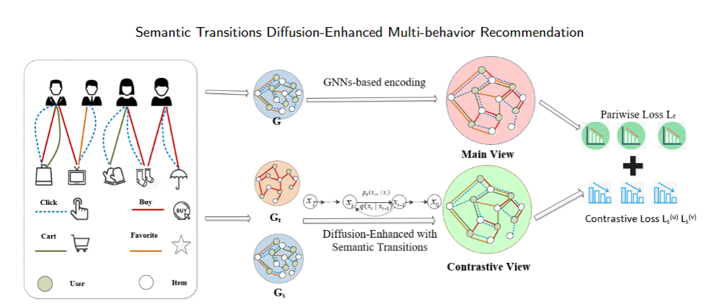

# WSDM'2025: STDE: Semantic Transitions Diffusion-Enhanced Multi-behavior Recommendation
>Framework

## Abstract
Multi-behavior recommendation focuses on estimating the likelihood of users interacting with
items under a specific target behavior by leveraging multi-behavior interaction data between
users and items. Such diverse interaction behaviors offer substantial potential to provide rich
information for understanding user preferences, thus enhancing recommendation performance.
In this paper, we propose a Semantic Transitions Diffusion Enhancement architecture based
on contrastive learning paradigms (STDE) for multi-behavior recommendation. In particular,
we first design a cross-type semantic transition strategy based on graph diffusion models to
construct contrastive views, thus enabling precise distillation of task-relevant information. At
its core, auxiliary behaviors are transformed into target semantic spaces via diffusion models
for contrastive view generation, thereby facilitating both cross-type transitions and cross-view
denoising. We then contrast the augmented view representations with the main-view repre-
sentations to update model parameters, thereby improving recommendation performance. We
conduct comprehensive experiments on three recommendation datasets, which demonstrate the
effectiveness of our STDE and its components compared with various state-of-the-art methods.
## Environment
- python=3.8
- torch=1.12.1
- numpy=1.23.1
- scipy=1.9.1
- dgl=1.0.2+cu113

## Datasets
| Dataset       | User \# | Item \# | Link \#    | Interaction Types               |
|---------------|---------|---------|------------|---------------------------------|
| Tmall         | 31882   | 31232   | 1,451,29   | View, Favorite, Cart, Purchase  |
| Retail Rocket | 2174    | 30113   | 97,381     | View, Cart, Transaction         |
| IJCAI         | 17435   | 35920   | 799,368    | View, Favorite, Cart, Purchase  |

